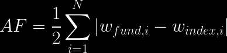

# Activism Measures

Managerial activism in mutual funds refers to fund managers' active involvement and decision-making approach in selecting and managing investment portfolios instead of passively following a market index. This concept embodies a fund manager's active engagement in stock selection, market timing, and strategic asset allocation to outperform benchmarks and achieve superior returns. Managerial activism is characterized by a proactive stance in investment decisions, often involving thorough research, analysis of market trends, and taking calculated risks. This approach contrasts with passive management, where a fund's portfolio mirrors a market index, relying on market efficiency rather than active decision-making. Managerial activism in mutual funds can significantly influence fund performance, risk profiles, and investor outcomes, reflecting the manager's expertise, strategies, and market insights in pursuing investment objectives.

## Active Share [Cremers and Petajisto, (2009)](https://doi.org/10.1093/rfs/hhp057)

Active Share is a metric introduced to assess the extent of active management in equity funds. The "Active Share" measure was introduced by K. J. Martijn Cremers and Antti Petajisto in their influential paper, "How Active Is Your Fund Manager? A New Measure That Predicts Performance". The concept is a cornerstone in evaluating active portfolio management. Active Share represents the proportion of fund holdings different from the benchmark index holdings. It's calculated for domestic equity mutual funds. This measure helps understand how much a fund manager deviates from a passive index replication strategy.

###  Calculation of Active Share

    

#### Key Points in the Measure:

- **Division by Two:** This is applied to avoid double-counting positions. Since the fund's portfolio and a typical passive portfolio (like the S&P 500) sum to 100% in weight, dividing by two ensures no overlap in the calculation.

     - **Evaluating Position Differences:** When both portfolios hold a position in a security, the absolute difference in weights indicates the distance of the fund from the benchmark. This controls whether the fund is underweighting or overweighting a position.

     - **Zero Weight Scenarios:** In cases where the fund has a position not mirrored in the benchmark or vice versa, the activism is captured by the weight present. This method accurately reflects the activism regardless of whether it's due to the fund holding a position that the benchmark doesn't or the reverse.

     - **Complete Divergence Cases:** If the fund's portfolio is entirely different from the benchmark, the comparison is made across all stocks in both portfolios. As the total weights of both portfolios are 100%, without adjusting for overlap, the Active Share could incorrectly sum to 200%. Hence, dividing by two is necessary.

     - **Non-Negativity and Short Positions:** Active Share is always non-negative. Short positions, typically reported in the liabilities section of a balance sheet, are not directly accounted for in the measure. This approach views Active Share as a long-short portfolio metric but focuses on non-perfect replicability due to independent weight optimization in the fund and benchmark.

#### Key Findings

- **Predictive Power:** Active Share is linked with fund performance. Funds with the highest Active Share tend to outperform their benchmarks before and after expenses.
- **Performance Persistence:** Funds exhibiting high Active Share demonstrate strong performance persistence.
- **Underperformance of Low Active Share Funds:** Funds with low Active Share, especially non-index funds, tend to underperform their benchmarks.

## Understanding Active Fund Overpricing (AFO) [Avramov et al., (2020)](https://pubsonline.informs.org/doi/abs/10.1287/mnsc.2019.3319)

The paper "Mutual Funds and Mispriced Stocks" by Doron Avramov, Si Cheng, and Allaudeen Hameed introduces a new measure of fund investment skill known as Active Fund Overpricing (AFO). This measure encapsulates a fund’s strategy regarding mispriced stocks and the dispersion of these stocks in the fund’s investment opportunity set.

### Concept of AFO

- **Investment Skill and Mispriced Stocks:** AFO is rooted in mutual funds taking active positions about mispriced stocks identified through various stock market anomalies.

- **Role of Stock Market Anomalies:** The identification of overpriced stocks is based on 11 well-known stock market anomalies. These anomalies, when averaged, help in pinpointing mispriced stocks. You can download the mispricing score from Stambaugh [web-page](https://finance.wharton.upenn.edu/~stambaug/). The information goes until Dec 2016. To extend the window of Dec 2016, you have to follow the construction of the score based on market anomalies explained by [Stambaugh and Yuan (2017)](https://doi.org/10.1093/rfs/hhw107)

- **Active Deviation in Investment:** AFO measures the active deviation of a mutual fund's investment in overpriced stocks relative to the investment weights implied by their benchmark portfolio.
- **Fund-Level Overpricing:** The measure aggregates the overpricing of stocks held by the fund more than the overpricing implied by the benchmark portfolio’s stocks.

    

### Implications of AFO

- **Skill Assessment:** High AFO is hypothesized to correlate with lower stock picking skills as funds actively overweight overpriced stocks, which are expected to yield lower returns as mispricing corrects over time.
- **Fund Characteristics:** Funds with higher AFO tend to have more considerable total net assets, higher expense ratios, higher turnover, and hold less liquid stocks.
- **Persistence in Overpricing:** The propensity of a fund to hold overpriced stocks tends to continue across quarters, indicating a persistent investment pattern.

## Activism on ESG (AFE)

Activism on ESG (AFE) extends the concept of activism analysis beyond mispricing to other stock characteristics, such as ESG (Environmental, Social, and Governance) scores. [Bofinger et al., (2022)](https://www.sciencedirect.com/science/article/pii/S1544612321002397) developed an activism measure based on ESG scores. This approach was inspired by the contributions of [Avramov et al., (2020)](https://pubsonline.informs.org/doi/abs/10.1287/mnsc.2019.3319), which opened the door to such extensions.

### Methodology

- **Stock Characteristic Requirements:** For a characteristic like ESG to maintain the same interpretability as the Mispricing score, it should be transformed into a number between zero and one, based on ranking procedures, ensuring a uniform distribution.

- **Data Sources:** There are multiple data providers for ESG scores, such as MSCI and Sustainalytics. However, different providers may lead to varying classifications of ESG, affecting the robustness of the measurement.
- **Integrating Multiple Sources:** [Gibson Brandom et al., (2022)](https://doi.org/10.1093/rof/rfac064) suggest integrating various sources using z-score averages to obtain a consensus measure.
- **Building or Obtaining ESG Scores:** It’s crucial to ensure the chosen source provides comprehensive stock identification to calculate portfolio measures accurately.

### Interpretation of AFE

- **Weight Comparison to Benchmark:** If a portfolio weighs a stock more heavily than the benchmark, the manager or group of managers is actively long on that ESG characteristic.
- **Intensity of ESG Position:** A high AFE implies a more intense long position in stocks with superior ESG scores. Conversely, a less intense position than the benchmark in superior ESG scores denotes less activity in ESG.
- **Zero AFE Values:** Negative or positive AFE values, closer to zero, suggest non-activity due to either closeness to the benchmark or being distant in a stock with low ESG.

