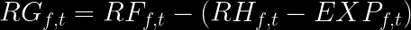

# Performance Measures

This section explores various ways to define performance in mutual funds, focusing on the standard and most commonly used methods in the literature. Performance is often gauged through returns, which can be net returns (after fees and costs) or gross returns. The complexity of these measures requires a solid understanding of mathematics and statistics to derive meaningful conclusions.

## Ex-Post Measures

Ex-post measures refer to performance already realized, incorporating the cumulative decisions of managers. While these measures effectively reflect the overall portfolio's performance, they may not fully capture managers' skills or added value.

### Alpha Risk-Adjusted (\(\alpha\))

- **Background**: The finance literature includes models like CAPM ([Sharpe, (1964)](https://onlinelibrary.wiley.com/doi/full/10.1111/j.1540-6261.1964.tb02865.x); .[Lintner, (1975)](https://www.sciencedirect.com/science/article/pii/B9780127808505500186)) and the three-factor model (.[Fama and French, (1993)](http://www.sciencedirect.com/science/article/pii/0304405X93900235)), which explain prices through risk factors. The concept extends to asset management, where portfolios are evaluated based on risk-adjusted performance.

- **Model Variations**: .[Carhart, 1997](https://onlinelibrary.wiley.com/doi/abs/10.1111/j.1540-6261.1997.tb03808.x) introduced the momentum factor (WML), while.[ Pastor and Stambaugh, 2003](https://www.journals.uchicago.edu/doi/abs/10.1086/374184) incorporated a liquidity risk factor. These models, however, are primarily applicable to equity portfolios.

- **Standard Application**:
  - The standard application involves OLS regressions to derive the intercept as the return from the portfolio not explained by risk factors:

    

  - An alternative approach in mutual funds compares the realized return with the expected return:

    

- **Considerations**: Calculating \(\alpha\) typically requires at least 12 months of data. However, this may introduce bias due to endogeneity and correlation with past variables. Focusing on one-step performance not explained by past factors can mitigate but not eliminate this bias.

This section aims to comprehensively understand how mutual fund managers' performance can be assessed using various risk-adjusted measures.

#### Code Clarifications for AlphaRiskAdjusted.R

The `AlphaRiskAdjusted.R` script utilizes parallel computing to calculate the intercept from various models, including CAPM, Fama French three-factor (FFF3), Fama French four-factor (FF4), Pastor and Stambaugh (PS), and Sadka (SK). The script is adaptable to alternative data approaches.

##### Key Aspects of the Script

- **Model Variations**: The script calculates alpha for different models:
  - **CAPM (CAPM)**
  - **Fama French 3 (FFF3)**
  - **3 + Momentum (FF4)**
  - **Pastor and Stambaugh: 4 + Illiquidity (PS)**
  - **Sadka: 4 + Illiquidity (SK)**

- **Monthly Frequency Data**: The data used in this script is at a monthly frequency. For complex models like PS and SK, which estimate six parameters, it's crucial to ensure enough observations for robust OLS estimation and to avoid issues with fit and alpha estimator noise.

- **Data Availability and Observation Count**: Due to varying start dates of funds and the requirement for at least 24 months of data (as suggested by .[Evans (2010)](https://onlinelibrary.wiley.com/doi/abs/10.1111/j.1540-6261.2010.01579.x) to avoid incubation bias), the script computes the number of observations for each regression. This helps determine the reliability threshold for the estimators.

- **Estimation Windows**: The script allows for rolling window estimations of 12, 24, and 36 months. More oversized windows increase observation counts, reducing estimator noise and increasing the historical data required. Balancing the window size to optimize the trade-off between estimator noise and historical data requirements is essential.

##### Application and Data Sources

- **Risk Factors Data (FactorsData)**: This dataset includes monthly risk factors, accessible from sources like Kenneth French's web ([link](https://mba.tuck.dartmouth.edu/pages/faculty/ken.french/data_library.html)), Stambaugh's web ([link](https://finance.wharton.upenn.edu/~stambaug/)), or WRDS.

- **Monthly Portfolio Returns**: Net returns data at the portfolio level is required. If starting with CRSP share class level data, it must be aggregated to the portfolio level. For more on this aggregation process, visit the [repository on Fund Level Aggregation](https://github.com/carr8824/Data-Cleaning/tree/main/DoctoralResearch-AssetManagement/FundLevel%20Aggregation).

- **Functions in the Script**:
  - `regress`: Calculates regression for a single fund.
  - `rolling`: Applies the regression function in a rolling window procedure.
  - `alphas`: Executes the function for all funds.

The script is designed to evaluate fund manager performance over time, adapting to varying fund histories and aiming to balance the trade-offs between estimator accuracy and historical data requirements.
 

### Return Gap (RGAP) [Kacperczyk et al., (2008)](https://academic.oup.com/rfs/article-lookup/doi/10.1093/rfs/hhl041)

The Return Gap (RGAP) is a metric that measures the impact of mutual fund managers' unobserved actions on fund performance. It is defined as the difference between the fund's reported return and the return of a hypothetical portfolio based on the fund's previously disclosed holdings.

#### Computation:
1. **Net Investor Return (RF):** The fund's net asset value changes, including dividends and capital gains.
2. **Return of Fund's Holdings (RH):** The return of a hypothetical portfolio that mirrors the fund's last disclosed holdings.
3. **Return Gap (RGAP):**

    

Where EXP represents the fund's expenses.

#### Relevance:

RGAP is essential to understand the effectiveness of a fund manager's hidden actions. These actions include trades and investment decisions not typically captured in regular financial reports, reflecting potential benefits and costs unseen in standard disclosures.

#### Implications:
- A positive RGAP indicates that the fund manager's unobserved actions have added value.
- A negative RGAP suggests hidden costs or inefficient decisions detracted from the fund's performance.

#### RGAP.R Explanation

The `RGAP.R` script is designed to work with mutual fund data, mainly focusing on the intricacies of net returns, expenses, and gross returns as reported in mutual fund datasets. For a comprehensive understanding of portfolio holdings and the calculation of complete, up-to-date portfolio holdings, refer to the [Portfolio Holdings MCU CRSPTHR repository](https://github.com/carr8824/Data-Cleaning/tree/main/DoctoralResearch-AssetManagement/PortfolioHoldings%20MCU%20CRSPTHR).

#### Data Frequency and Sources

- **Net Returns and Expenses Reporting**: Net returns and expenses in mutual funds are reported by CRSP. Notably, returns are available monthly, whereas costs are annualized.

- **Gross Returns**: Gross returns data is provided every quarter. This frequency aligns with the reporting of portfolio holdings and the quarterly returns of securities, underlining the assumption of buy-and-hold within a quarter due to observable holdings only every quarter.

#### Databases Used in the Code

1. **Quarterly Stock Returns (QuarterlyStock)**: This database contains information on stock returns at a quarterly frequency.

2. **Portfolio Holdings (MFHoldings)**: Using this data, the script calculates the gross returns (PGRet) and the Forward Hypothetical Return (FRH) for each portfolio.

3. **Realized Net Returns and Annualized Expenses**: Once the gross returns are calculated, the script integrates the reported net returns from funds (monthly frequency) and annualized expenses. These can be extracted from CRSP's summary information and returns data.

#### Data Processing and Aggregation

- **Harmonizing Data Frequencies**: The script converts data not originally in quarterly format to a quarterly basis. Monthly returns are compounded, and annual expenses are linearly interpolated (or divided by four).

- **Equation Application**: The script then applies the previously discussed equations to calculate the necessary performance measures.

- **Aggregating Returns at Portfolio Level**: It's crucial to note that the return data from CRSP is reported at the share class level. All returns need to be aggregated at the portfolio level for this script. For more details on this aggregation process, visit the [Fund Level Aggregation repository](https://github.com/carr8824/Data-Cleaning/tree/main/DoctoralResearch-AssetManagement/FundLevel%20Aggregation).

## Ex-ante Measures

Ex-ante measures differ significantly from ex-post measures in evaluating portfolio management. While ex-post measures focus on past performance, ex-ante measures are forward-looking, assessing the potential future impact of a manager's decisions on portfolio composition.

- **Focus on Future Performance:** Ex-ante measures evaluate a manager's ability to anticipate future market prices rather than merely analyzing past performance averages.
- **Insight into Managerial Decision-Making:** These measures provide insights into the value derived from managers' decisions in upcoming periods, offering a different perspective than ex-post measures, reflecting past decisions' realized outcomes.

- **Beyond Performance Metrics:** Unlike performance metrics that aggregate various factors such as fees, market conditions, and operational aspects, ex-ante measures offer a more focused evaluation. They provide a clear picture of the portfolio's competitiveness relative to a benchmark portfolio.
- **Comparative Analysis:** Ex-ante measures allow for a refined understanding of a manager's ability by comparing the portfolio's potential against a predefined benchmark rather than solely relying on past performance data.

This approach to measurement emphasizes the strategic aspect of portfolio management, highlighting a manager's foresight and anticipatory skills, which are crucial in the ever-evolving financial markets.

### Characteristic Selectivity .[Daniel et al., (1997)](https://onlinelibrary.wiley.com/doi/abs/10.1111/j.1540-6261.1997.tb02724.x)

The CS measure offers an innovative method to assess mutual fund performance, focusing on three key stock characteristics: market capitalization, book-to-market ratio, and prior-year return. This approach aligns with the latest findings in finance research, indicating that these characteristics are robust predictors of stock returns.

#### Key Advantages of CS Measure
- **Granular Risk Adjustment:** Unlike traditional alpha measures, CS allows for a more nuanced risk adjustment at the stock level.
- **Ex-ante Evaluation:** Provides an alternative method for assessing managerial ability without relying excessively on past performance data, thus reducing endogeneity issues.
- **Real-Time Portfolio Assessment:** Evaluates the entire portfolio based on the latest market prices, offering a more current and relevant analysis.

#### Methodology
The CS measure compares a mutual fund's performance against 125 passive portfolios, categorized based on size, book-to-market ratio, and momentum. The measure is calculated as follows:

### CS Calculation
1. **Portfolio Formation:** Sort stocks into 125 portfolios based on quintile rankings of size, book-to-market ratio, and prior-year return.
2. **Excess Return Calculation:** For each stock, calculate the excess return over the matched passive portfolio.
3. **Weighted Abnormal Return:** Aggregate these excess returns, weighted by their respective portfolio weights, to obtain the fund's abnormal performance.

#### BenchmarkAdjustedReturns.R Code explanations (Methodology based Daniel, et al. (1997))

##### Data Sources
- **Quarterly Compustat Data**: Financial metrics like assets and liabilities. They are used to calculate financial ratios and standardize reporting periods.
- **Monthly CRSP Prices Data**: Includes end-of-month stock prices. Employed for price data and momentum calculations.

The codes do: 

a. **Preprocessing Monthly CRSP Data**: Arranges data, calculates momentum using stock prices, and compiles quarterly returns.
b. **Preprocessing Quarterly Compustat Data**: Standardizes reporting dates, ensuring uniformity in the quarterly financial data.
c. **Merging Data**: Combines Compustat and CRSP data, aligning financial metrics with stock prices for a comprehensive dataset.
d. **Calculating Momentum**: Computes stock performance momentum based on rolling quarterly returns.
e. **Portfolio Classification**: Classifies stocks into 125 portfolios using Market Equity, Book-to-Market Ratio, and Momentum.
f. **Benchmark Adjusted Returns Calculation**: Determines both Equally Weighted and Value-Weighted Benchmark Adjusted Returns for portfolios.

### Trading Selectivity 

