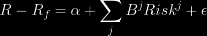

# Performance Measures

## Overview

This section explores various ways to define performance in mutual funds, focusing on the standard and most commonly used methods in the literature. Performance is often gauged through returns, which can be net returns (after fees and costs) or gross returns. The complexity of these measures requires a solid understanding of mathematics and statistics to derive meaningful conclusions.

## Ex-Post Measures

Ex-post measures refer to performance already realized, incorporating the cumulative decisions of managers. While these measures effectively reflect the overall portfolio's performance, they may not fully capture managers' skills or added value.

### Alpha Risk-Adjusted (\(\alpha\))

- **Background**: The finance literature includes models like CAPM ([Sharpe, (1964)](https://onlinelibrary.wiley.com/doi/full/10.1111/j.1540-6261.1964.tb02865.x); .[Lintner, (1975)](https://www.sciencedirect.com/science/article/pii/B9780127808505500186)) and the three-factor model (.[Fama and French, (1993)](http://www.sciencedirect.com/science/article/pii/0304405X93900235)), which explain prices through risk factors. The concept extends to asset management, where portfolios are evaluated based on risk-adjusted performance.

- **Model Variations**: .[Carhart, 1997](https://onlinelibrary.wiley.com/doi/abs/10.1111/j.1540-6261.1997.tb03808.x) introduced the momentum factor (WML), while.[ Pastor and Stambaugh, 2003](https://www.journals.uchicago.edu/doi/abs/10.1086/374184) incorporated a liquidity risk factor. These models, however, are primarily applicable to equity portfolios.

- **Standard Application**:
  - The standard application involves OLS regressions to derive the intercept as the return from the portfolio not explained by risk factors:

  - An alternative approach in mutual funds compares the realized return with the expected return:

    

- **Considerations**: Calculating \(\alpha\) typically requires at least 12 months of data. However, this may introduce bias due to endogeneity and correlation with past variables. Focusing on one-step performance not explained by past factors can mitigate but not eliminate this bias.

This section aims to comprehensively understand how mutual fund managers' performance can be assessed using various risk-adjusted measures.

#### Code Clarifications for AlphaRiskAdjusted.R

The `AlphaRiskAdjusted.R` script utilizes parallel computing to calculate the intercept from various models, including CAPM, Fama French three-factor (FFF3), Fama French four-factor (FF4), Pastor and Stambaugh (PS), and Sadka (SK). The script is adaptable to alternative data approaches.

##### Key Aspects of the Script

- **Model Variations**: The script calculates alpha for different models:
  - **CAPM (CAPM)**
  - **Fama French 3 (FFF3)**
  - **3 + Momentum (FF4)**
  - **Pastor and Stambaugh: 4 + Illiquidity (PS)**
  - **Sadka: 4 + Illiquidity (SK)**

- **Monthly Frequency Data**: The data used in this script is at a monthly frequency. For complex models like PS and SK, which estimate six parameters, it's crucial to ensure enough observations for robust OLS estimation and to avoid issues with fit and alpha estimator noise.

- **Data Availability and Observation Count**: Due to varying start dates of funds and the requirement for at least 24 months of data (as suggested by .[Evans (2010)](https://onlinelibrary.wiley.com/doi/abs/10.1111/j.1540-6261.2010.01579.x) to avoid incubation bias), the script computes the number of observations for each regression. This helps determine the reliability threshold for the estimators.

- **Estimation Windows**: The script allows for rolling window estimations of 12, 24, and 36 months. More oversized windows increase observation counts, reducing estimator noise and increasing the historical data required. Balancing the window size to optimize the trade-off between estimator noise and historical data requirements is essential.

##### Application and Data Sources

- **Risk Factors Data (FactorsData)**: This dataset includes monthly risk factors, accessible from sources like Kenneth French's web ([link](https://mba.tuck.dartmouth.edu/pages/faculty/ken.french/data_library.html)), Stambaugh's web ([link](https://finance.wharton.upenn.edu/~stambaug/)), or WRDS.

- **Monthly Portfolio Returns**: Net returns data at the portfolio level is required. If starting with CRSP share class level data, it must be aggregated to the portfolio level. For more on this aggregation process, visit the [repository on Fund Level Aggregation](https://github.com/carr8824/Data-Cleaning/tree/main/DoctoralResearch-AssetManagement/FundLevel%20Aggregation).

- **Functions in the Script**:
  - `regress`: Calculates regression for a single fund.
  - `rolling`: Applies the regression function in a rolling window procedure.
  - `alphas`: Executes the function for all funds.

The script is designed to evaluate fund manager performance over time, adapting to varying fund histories and aiming to balance the trade-offs between estimator accuracy and historical data requirements.
 

### Return Gap (RGAP)

## Ex-ante Measures

### Characteristic Selectivity

### Trading Selectivity 

